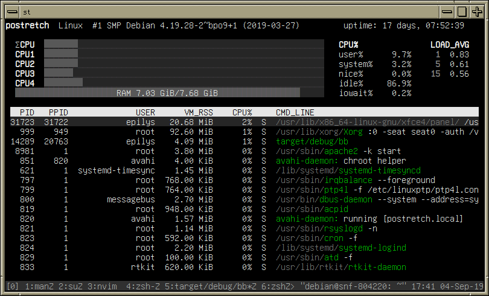

[![License]][gpl3]&nbsp;[![No Maintenance Intended]][no-maintenance]

[gpl3]: https://github.com/epilys/bb/blob/main/COPYING
[License]: https://img.shields.io/github/license/epilys/bb?color=white
[No Maintenance Intended]: https://img.shields.io/badge/No%20Maintenance%20Intended-%F0%9F%97%99-red
[no-maintenance]: https://unmaintained.tech/

## NAME
     bb — your system's Big Brother

## SYNOPSIS
```
     bb
```

## DESCRIPTION
simple process viewer (for functionalities, press `h` within `bb` or see shortcuts below)

 

## WHY
This is a "weekend" side-project made for fun, but it ended up somewhat useful and fast. Performance seems on par with `htop` without having done any benchmarks, however in contrast to `htop`, `bb` doesn't leave artifacts when it redraws the screen. I am not completely sure this is `htop`'s fault though, feel free to correct me.

## INSTALL
Prerequisites: [cargo](https://www.rust-lang.org/tools/install) >= 1.36, Linux

```
cargo install bb
```

## BUILD
     Prerequisites: rustc, cargo >= 1.36, Linux

     Execute `cargo build --release`, resulting binary will be in
     ./target/release/bb

## SHORTCUTS
```
      'h'   Toggle help overlay
      'F'   Follow process and its children. Type the pid you want to follow
      'L'   Highlight process. Type the pid you want to highlight
      'k'   Kill process under cursor
            Press Enter to confirm kill, or Esc to cancel
      'f'   (un)freeze process list updates
      '/'   Search process list
			'n'   Next search result
			'N'   Previous search result
      Space Filter process list
      't'   toggle tree view
      F1    toggles/activates username sorting
      F2    toggles/activates vm_rss sorting
      F3    toggles/activates cpu% sorting
      F4    toggles/activates cmd_line sorting
      Esc   Cancel action
```

## AUTHORS
     Copyright 2019 Manos Pitsidianakis <epilys@nessuent.xyz> Released
     under the GPL, version 3 or greater. This software carries no warranty of
     any kind. (See COPYING for full copyright and warranty notices.)

⟨ https://nessuent.xyz/ ⟩

                                 September 04, 2019
